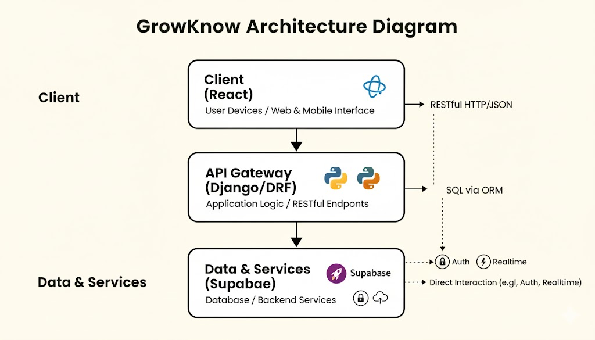
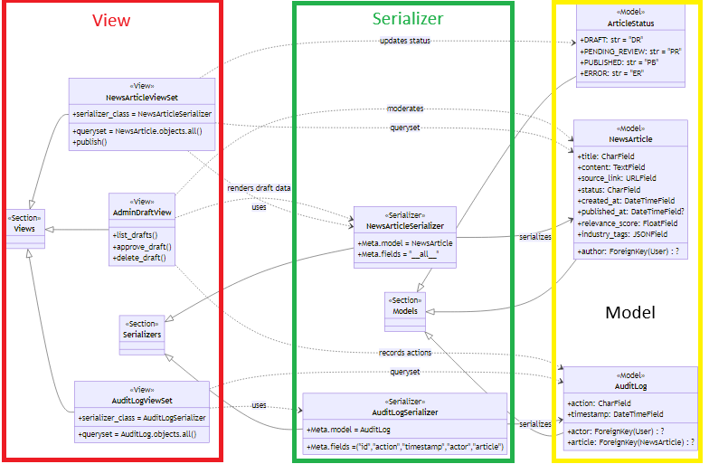

# Software Architecture Document

# Table of Contents
- [Introduction](#1-introduction)
    - [Purpose](#11-purpose)
    - [Scope](#12-scope)
    - [Definitions, Acronyms and Abbreviations](#13-definitions-acronyms-and-abbreviations)
    - [References](#14-references)
    - [Overview](#15-overview)
- [Architectural Representation](#2-architectural-representation)
- [Architectural Goals and Constraints](#3-architectural-goals-and-constraints)
- [Use-Case View](#4-use-case-view)
    - [Use-Case Realizations](#41-use-case-realizations)
- [Logical View](#5-logical-view)
    - [Overview](#51-overview)
    - [Architecturally Significant Design Packages](#52-architecturally-significant-design-packages)
    - [Pattern](#53-Pattern)
- [Process View](#6-process-view)
- [Deployment View](#7-deployment-view)
- [Implementation View](#8-implementation-view)
    - [Overview](#81-overview)
    - [Layers](#82-layers)
- [Data View](#9-data-view)
- [Size and Performance](#10-size-and-performance)
- [Quality](#11-quality)

---

## 1. Introduction

### 1.1 Purpose
This document provides a comprehensive architectural overview of the **GrowKnow** system, using a number of different architectural views to depict different aspects of the system. It is intended to capture and convey the significant architectural decisions which have been made on the system.

### 1.2 Scope
This document describes the technical architecture of the **GrowKnow** project, including the structure of classes, modules, and dependencies for the **decoupled Django/React application using Supabase**.

### 1.3 Definitions, Acronyms and Abbreviations

| Abbrevation | Description                              |
|-------------|------------------------------------------|
| API         | Application Programming Interface        |
| **BaaS**    | **Backend-as-a-Service**                 |
| **BDD**     | **Behavior-Driven Development**          |
| **DRF**     | **Django REST Framework**                |
| **MVT**     | **Model View Template** (Django Pattern) |
| **ORM**     | **Object-Relational Mapper**             |
| REST        | Representational State Transfer          |
| SDK         | Software Development Kit                 |
| SRS         | Software Requirements Specification      |
| UC          | Use Case                                 |
| VCS         | Version Control System                   |
| n/a         | not applicable                           |

### 1.4 References

| Title                                 | Date | Publishing organization                                                   |
|---------------------------------------|:----:|---------------------------------------------------------------------------|
| React Documentation                   | n/a  | [React](https://react.dev/learn/thinking-in-react)                        |
| Behave BDD Documentation              | n/a  | [Behave BDD](https://behave.readthedocs.io/en/stable/)                    |
| Supabase Documentation                | n/a  | [Supabase](https://supabase.com/docs/guides/getting-started/architecture) |
| Django Documentation                  | n/a  | [Django](https://www.djangoproject.com/)                                  |

### 1.5 Overview
This document contains the Architectural Representation, Goals and Constraints as well as the Logical, Deployment, Implementation, and Data Views for the **GrowKnow** system.

---

## 2. Architectural Representation
The GrowKnow project utilizes a **decoupled three-tier architecture**.

* **Frontend (Tier 1):** React application handling all presentation and user interaction.
* **Backend/API Gateway (Tier 2):** Django application using DRF to implement business logic and expose a RESTful API.
* **Data and Services (Tier 3):** Supabase (PostgreSQL, Auth, Realtime) handles persistent data storage and core backend services.

The architecture is a variation of the traditional **Model-View-Controller (MVC)** pattern, specifically the **Model-View-Template (MVT)** pattern for Django, where the React frontend replaces Django's Template layer, creating a **Model-View-Serializer (MVS)** structure on the backend.

---

## 3. Architectural Goals and Constraints

**Key Architectural Goals:**

* **Scalability:** Clear separation of concerns (frontend, backend API, database) allows for independent scaling of each component.
* **Rapid Development:** Using Django's ORM and Supabase's managed services accelerates feature implementation.
* **Maintainability:** Utilizing established patterns like Container/Presentational components in React and MVT/DRF in Django ensures clean, testable code.
* **Data Integrity:** Relying on PostgreSQL via Supabase ensures transactional integrity and powerful relational capabilities.
* **Secure API:** All data access is mediated and authorized by the Django API, which validates user tokens managed by Supabase Auth.

**Constraints:**

* **Supabase Dependency:** We are dependent on Supabase for the primary database, authentication, and real-time services.
* **API Contract:** The frontend and backend must strictly adhere to the defined REST API contract.

---

## 4. Use-Case View
Please refer to the **Overall Use Case Diagram** in our project's [SRS](Software_Requirements_Specification.md) file for the full view.

---

## 5. Logical View

### 5.1 Overview
The logical view is split between the backend components (Django) and the frontend components (React).

**Backend (Django):**

* **Models:** Python classes defining the structure and relationships of application data.
* **Views (DRF ViewSets/APIViews):** Implement the core API logic, handling requests and coordinating data access.
* **Serializers:** Responsible for converting data between Django Models (Python objects) and JSON format for the API.

**Frontend (React):**

* **Container Components (Smart):** Manage state and data fetching logic (calls to the Django API).
* **Presentational Components (Dumb):** Focus purely on rendering the UI based on props.
* **Custom Hooks:** Encapsulate reusable logic (e.g., authentication, API interactions).

### 5.2 Architecturally Significant Design Packages
The class diagram; containing all Data Access Objects, Models and Controllers that we will need to finish for the basic functionality:

---

## 6. Process View
The process view describes the runtime interactions and concurrency.

* The **React Frontend** runs as a single-page application (SPA) in the client's browser.
* The **Django Backend** runs as a multi-process/threaded API server (e.g., via Gunicorn/Nginx), handling concurrent REST requests.
* **Supabase Realtime** uses WebSockets for asynchronous, bidirectional communication for live data updates, separate from the primary REST API processes.
* **Testing:** **Behave** executes tests as an independent process, simulating user actions against the deployed or local system.

---

## 7. Deployment View
The system is deployed across multiple environments.

| Component             | Deployment Environment        | Host/Service |
|-----------------------|-------------------------------|--------------|
| **Frontend (React)**  | Statically served files (SPA) | n/a          |
| **Backend (Django)**  | Application Server            | n/a          |
| **Data & Services**   | Managed Service               | **Supabase** |
| **Version Control**   | Repository                    | GitHub       |

---

## 8. Implementation View
The core technologies and languages are:

| Component           | Technology                    | Language              | Version Control         |
|---------------------|-------------------------------|-----------------------|-------------------------|
| **Backend**         | Django, Django REST Framework | Python                | Git                     |
| **Frontend**        | React, React Router           | JavaScript/TypeScript | Git                     |
| **Database**        | PostgreSQL                    | SQL                   | Supabase CLI/Migrations |
| **Testing**         | **Behave**                    | Python (Gherkin)      | Git                     |

---

## 9. Data View
n/a

---

## 10. Size and Performance
n/a

---

## 11. Quality/Metrics
n/a

---