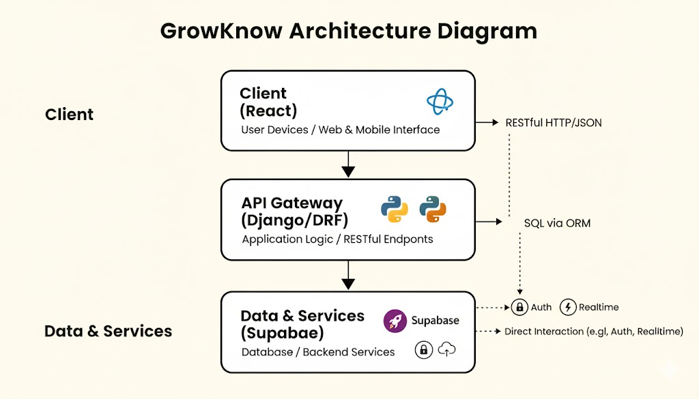
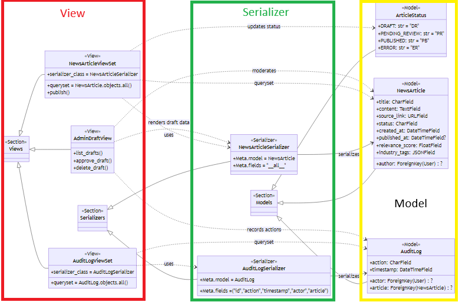

# Software Architecture Document

# Table of Contents
- [Introduction](#1-introduction)
    - [Purpose](#11-purpose)
    - [Scope](#12-scope)
    - [Definitions, Acronyms and Abbreviations](#13-definitions-acronyms-and-abbreviations)
    - [References](#14-references)
    - [Overview](#15-overview)
- [Architectural Representation](#2-architectural-representation)
- [Architectural Goals and Constraints](#3-architectural-goals-and-constraints)
- [Use-Case View](#4-use-case-view)
    - [Use-Case Realizations](#use-case-realizations)
- [Logical View](#5-logical-view)
    - [Overview](#51-overview)
    - [Architecturally Significant Design Packages](#52-architecturally-significant-design-packages)
    - [Pattern](#pattern)
- [Process View](#6-process-view)
- [Deployment View](#7-deployment-view)
- [Implementation View](#8-implementation-view)
    - [Overview](#implementation-overview)
    - [Layers](#implementation-layers)
- [Data View](#9-data-view)
- [Size and Performance](#10-size-and-performance)
- [Quality](#quality)

---

## 1. Introduction

### 1.1 Purpose
This document provides a concise architectural overview of **GrowKnow** and describes the main runtime parts, data flow, and deployment assumptions used by the current implementation.

### 1.2 Scope
This document describes the technical architecture of the **GrowKnow** project, including the structure of the frontend, backend API, automation workflows, and data sources for the **decoupled React/Vite, Django REST, and n8n-based application**.

### 1.3 Definitions, Acronyms and Abbreviations

| Abbrevation | Description                              |
|-------------|------------------------------------------|
| API         | Application Programming Interface        |
| **DRF**     | **Django REST Framework**                |
| **MVT**     | **Model View Template** (Django Pattern) |
| **MVS**     | **Model View Serializer**                |
| **ORM**     | **Object-Relational Mapper**             |
| REST        | Representational State Transfer          |
| SRS         | Software Requirements Specification      |
| UC          | Use Case                                 |
| SPA         | Single-Page Application                  |
| n8n         | Workflow automation platform             |
| n/a         | not applicable                           |

### 1.4 References

| Title                              | Date | Publishing organization                                                   |
|------------------------------------|:----:|---------------------------------------------------------------------------|
| React Documentation                | n/a  | [React](https://react.dev/learn)                                          |
| Vite Documentation                 | n/a  | [Vite](https://vitejs.dev/guide/)                                          |
| Django Documentation               | n/a  | [Django](https://www.djangoproject.com/)                                  |
| Django REST Framework Documentation | n/a  | [DRF](https://www.django-rest-framework.org/)                             |
| Supabase Documentation             | n/a  | [Supabase](https://supabase.com/docs)                                     |
| n8n Documentation                  | n/a  | [n8n](https://docs.n8n.io/)                                               |

### 1.5 Overview
This document contains the Architectural Representation, Goals and Constraints, Use-Case View, Logical View, Process View, Deployment View, Implementation View, Data View, and placeholders for size/performance and quality notes.

---

## 2. Architectural Representation
The GrowKnow project utilizes a **decoupled three-part architecture**.

* **Frontend:** React/Vite application handling presentation and user interaction.
* **Backend/API:** Django application using DRF to expose the REST API and admin interface.
* **Automation/Ingestion:** n8n workflows that collect, filter, format, and submit content to the backend.

The backend follows the **Model-View-Template (MVT)** pattern from Django, while the React frontend replaces the template layer in the user-facing experience. In practice, the API is organized around a **Model-View-Serializer (MVS)** style for JSON responses.

---

## 3. Architectural Goals and Constraints

**Key Architectural Goals:**

* **Separation of concerns:** frontend, backend API, and ingestion workflows can evolve independently.
* **Maintainability:** React components, Django models/views/serializers, and n8n workflows are kept in separate layers.
* **Traceable content flow:** external content is ingested through n8n before reaching the backend.
* **Flexible storage:** local development can use SQLite, while production can use Supabase/Postgres.
* **Consistent API access:** the Django API remains the primary supported backend interface for articles and tools.

**Constraints:**

* **Optional Supabase reads:** Supabase may be used when configured, but the frontend must still function through the Django API.
* **REST API contract:** frontend and backend must adhere to the documented endpoints and payloads.
* **Workflow dependency:** n8n depends on the external RSS source, Ollama availability, and backend reachability.

---

## 4. Use-Case View
Please refer to the **Overall Use Case Diagram** in our project's [SRS](Software_Requirements_Specification.md) file for the full view.

---

## 5. Logical View

### 5.1 Overview
The logical view is split between the frontend application, the Django backend, and the n8n ingestion layer.

**Backend (Django):**

* **Models:** Python classes defining the structure and relationships of application data.
* **Views (DRF ViewSets/APIViews):** Implement API logic, handle requests, and coordinate data access.
* **Serializers:** Convert between Django models and JSON payloads.
* **Admin site:** supports content review and operational management.

**Frontend (React):**

* **Pages and components:** render the browser UI for news, tools, and related content.
* **API helpers:** centralize requests to the Django backend and optional Supabase read path.
* **Custom hooks:** encapsulate reusable client-side logic.

**n8n automation:**

* **Schedule trigger:** runs the ingestion pipeline on a fixed interval.
* **RSS fetch and filtering:** retrieves AI news and keeps only relevant items.
* **Ollama classification:** helps reject unrelated articles.
* **Backend push:** posts accepted content to Django.

### 5.2 Architecturally Significant Design Packages
The class diagram shows the primary backend models, data-access paths, and controller-style elements used to support the basic functionality:

### Pattern
The implementation uses a component-based frontend, a serializer-driven Django REST backend, and n8n workflows for ingestion. More detailed pattern decisions are *to review* if the implementation changes.

---

## 6. Process View
The process view describes the runtime interactions and concurrency.

* The **React/Vite frontend** runs as a single-page application in the client's browser.
* The **Django backend** runs as a web/API server and handles concurrent REST requests.
* **n8n** runs as a separate automation service and periodically ingests news from the external RSS source.
* **Ollama** is invoked by the n8n workflow for content classification.
* **Optional Supabase reads** occur only when the frontend is configured with the appropriate environment variables.

---

## 7. Deployment View
The system is deployed across multiple environments.

| Component | Deployment Environment | Host/Service |
|-----------------------|-------------------------------|--------------|
| **Frontend (React/Vite)** | Static web app / dev server | n/a |
| **Backend (Django)** | Application server | n/a |
| **Automation (n8n)** | Docker Compose service | n/a |
| **Database** | SQLite locally / Supabase Postgres in production | n/a |
| **Version Control** | Repository | GitHub |

---

## 8. Implementation View
The core technologies and languages are:

| Component | Technology | Language | Version Control |
|---------------------|-------------------------------|-----------------------|-------------------------|
| **Backend** | Django, Django REST Framework | Python | Git |
| **Frontend** | React, Vite, React Router | JavaScript/TypeScript | Git |
| **Database** | SQLite / PostgreSQL | SQL | Git / Supabase tooling |
| **Automation** | n8n, Docker Compose | JSON / workflow config | Git |
| **Testing** | Behave, pytest | Python (Gherkin) | Git |

### Implementation Overview
The implementation is split across the frontend, backend, automation workflow, and data storage layers described above.

### Implementation Layers
* Presentation layer: React/Vite frontend.
* Service layer: Django REST API and admin.
* Automation layer: n8n ingestion workflow.
* Persistence layer: SQLite locally or Supabase/PostgreSQL in production.

---

## 9. Data View

The main data groups currently reflected in the documentation are:

* AI news articles and their metadata.
* AI tools and filtering metadata.
* Role-based learning roadmap content.
* Automation inputs and ingestion results.
* User and admin-related operational data, where applicable.

---

## 10. Size and Performance
n/a

---

## Quality
n/a

---

