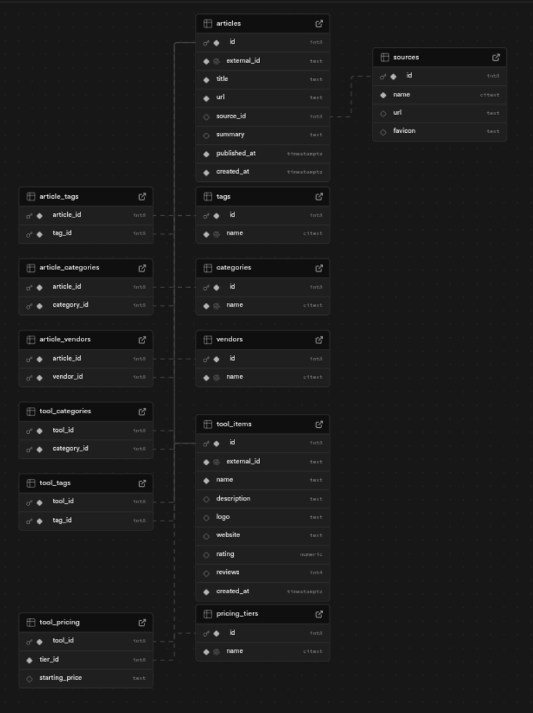
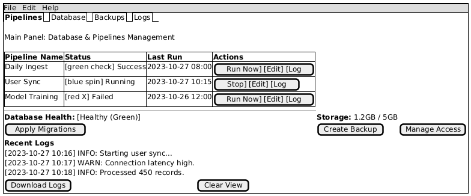

# 3.1.3 Manage Database & Pipelines

# 1 Brief Description
An administrator can configure, create, run, monitor and maintain data pipelines and the application database.

# 2 Flow of Events
## 2.1 Basic Flow
1. **Admin:** Open "Database & Pipelines" from the admin console.
2. **System:** Display list of pipelines, recent runs, database status, and available actions (migrate, backup, restore, run, schedule, view logs).
3. **Admin:** Select an item (pipeline or database operation).
4. **System:** Show details (configuration, schedule, last runs, health metrics).
5. **Admin:** Choose action: run now / schedule / apply migration / create backup / restore / edit configuration.
6. **System:** Validate request, enqueue the operation, and start execution where applicable.
7. **System:** Stream or store run logs; update status on completion.
8. **Admin:** Review results, inspect logs, and acknowledge or retry on failure.
9. **System:** Persist audit entries for configuration changes and runs.

### 2.1.1 Activity Diagram

*diagram placeholder — to be added*

### 2.1.2 Mock-up

*mock-up placeholder — to be added*

### 2.1.3 Narrative
```gherkin
Feature: Manage Supabase database

  As an administrator
  I want to apply schema migrations, manage backups, and configure access on the Supabase project
  So that the production database remains consistent, secure and recoverable.

  Background:
    Given an administrator exists and is authenticated

  Scenario: Apply schema migrations successfully
    When the administrator applies schema migrations
    Then the database schema is up to date

  Scenario: Create and restore a database backup
    When the administrator creates a database backup
    Then a backup file is stored

    When the administrator restores the database from the latest backup
    Then the restore operation completes successfully

  Scenario: Configure database access for a team member
    Given a user "db_maintainer" exists
    When the administrator grants the user database-admin access
    Then the user "db_maintainer" has elevated database permissions

  Scenario: Run, monitor and verify data pipeline
    When the administrator starts the data pipeline run named "daily_ingest"
    Then the pipeline run completes with status "SUCCESS"
    And pipeline run logs contain the text "processed" and "completed"

  Scenario: Handle migration failure gracefully
    Given a migration error is simulated
    When the administrator applies schema migrations
    Then the system reports a migration failure
    And an alert is recorded for administrator review

  Scenario: Backup failure is reported and retried
    Given the backup process is simulated to fail
    When the administrator creates a database backup
    Then the system records the backup failure and schedules a retry
```
This Narrative is implemented in a [seperate document](https://github.com/bermar24/growknow/blob/main/features/steps/database_pipelines_steps.py).

## 2.2 Alternative Flows

**A. Migration conflict or failure**

* **System:** Detects a migration error during apply.
* **Admin:** Sees detailed error and stack trace.
* **Admin:** Chooses to rollback or fix migration scripts.
* **System:** Records failure in audit and alerts operators.

**B. Backup failure**

* **System:** Records backup failure and schedules a retry according to policy.
* **Admin:** Notified and may trigger a manual backup.

**C. Pipeline run failure**

* **System:** Marks run as failed, stores logs and partial outputs.
* **Admin:** Can re-run or inspect logs and retry from the last successful step.

**D. Insufficient permissions**

* **System:** Refuses the request and returns an authorization error.
* **Admin:** Requests elevated access or asks a privileged user to perform the action.

# 3 Special Requirements

- Role-based access control (RBAC) for pipeline and database operations.
- Audit logging for all configuration changes, migrations, backups, restores, and manual runs.
- Backup retention policy and secure storage for backup artifacts.
- Safe migration process with dry-run and rollback support.
- Read-only monitoring endpoints for pipeline health and metrics.

# 4 Preconditions

- Administrator account with appropriate privileges.
- Network access and credentials to Supabase/Postgres and any pipeline targets.
- CI/CD pipeline or migration artifacts available where applicable.

# 5 Postconditions

- Successful operations update system state and persist audit entries.
- Backups stored in configured storage and listed in the UI.
- Failed operations produce actionable logs and alerts.

# 6 Extension Points

- Integration with external orchestration tools (e.g., Airflow) for advanced scheduling.
- Integration with monitoring and alerting (Prometheus, Grafana, PagerDuty).
- Automated migration review and approvals through a pull-request process.
