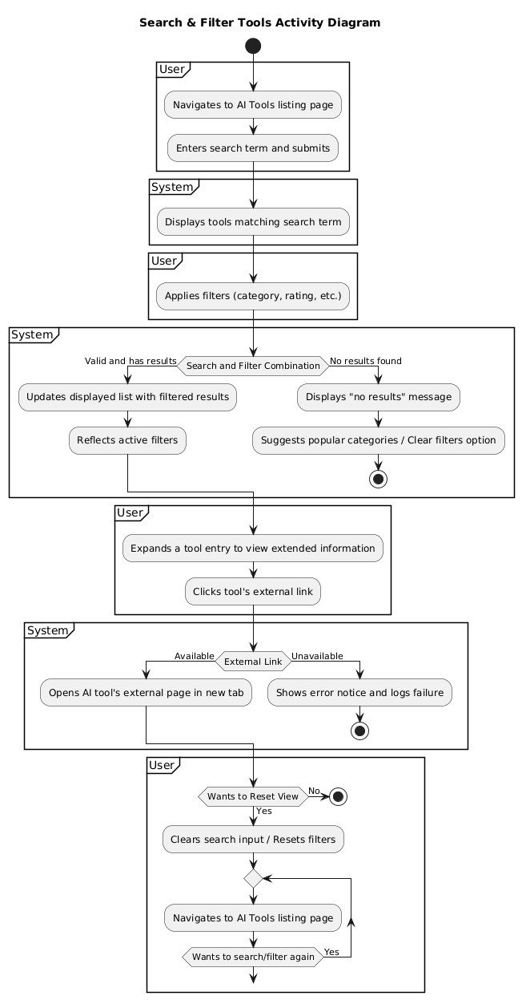
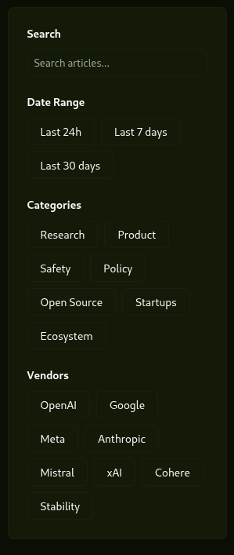

# 3.1.4 Search & Filter Tools

# 1 Brief Description
A user can discover and narrow down the most popular AI tools. The user may enter a search term (tool name or keyword) and apply one or more filters to refine results. Each tool in the results can be expanded to show additional details and includes a link that redirects the user to the AI tool's external page.

# 2 Flow of Events
## 2.1 Basic Flow
- User navigates to the AI Tools listing page.
- User enters text in the search bar and presses Enter or selects a suggested term.
- System displays a list of tools matching the search term, ranked by relevance and optionally popularity.
- User applies filters (for example: category, rating, price range, platform, license).
- System updates the displayed list immediately (or after the user confirms) to reflect active filters.
- User expands a tool entry to view extended information (description, features, rating, tags).
- User clicks the tool's external link to open the AI tool in a new browser tab or window.
- If the user wants to reset the view, they clear the search input and/or reset filters to see the default list.

### 2.1.1 Activity Diagram



### 2.1.2 Mock-up


### 2.1.3 Narrative
```gherkin
Feature: Search and filter AI tools

  As a user browsing AI tools
  I want to search by name or keyword and apply filters
  So that I can quickly find tools that match my needs and view more details before visiting the tool's site.

  Scenario: Search returns relevant tools
    Given the user is on the AI Tools page
    When the user searches for "semantic search"
    Then the system returns tools matching the query sorted by relevance

  Scenario: Apply category and price filters
    Given the user is viewing the tools list
    When the user applies category "search" and price "free"
    Then the system displays matching tools that are free and in the search category

  Scenario: No results found
    Given the user searches for an uncommon term
    Then the system shows a friendly "no results" message and suggests categories
```
This Narrative is implemented in a [separate document](https://github.com/bermar24/growknow/blob/main/features/steps/search_filter_tools_steps.py).

## 2.2 Alternative Flows
- No results found: system displays a "no results" message and suggests related categories or popular tools.
- Invalid filter combination: system warns the user and disables the invalid combination until adjusted.
- External link unavailable: system shows an error and logs the failure for diagnostics; users can copy the URL.

# 3 Special Requirements
- Search must be responsive and return results within acceptable bounds on normal developer hardware (target: <2s for common queries) *to review*.
- Filters should be composable and persist in the URL for shareable views.
- External tool links open in a new tab and are tracked for analytics.

# 4 Preconditions
- The tool catalog must be populated and indexed.
- Search index (OpenSearch) should be available when configured; otherwise the backend API serves queries.

# 5 Postconditions
- Search results reflect current filters and query.
- Analytics events recorded for performed searches and link clicks.

# 6 Extension Points
- Faceted navigation for advanced taxonomy.
- Integration with user bookmarks and favorites.
